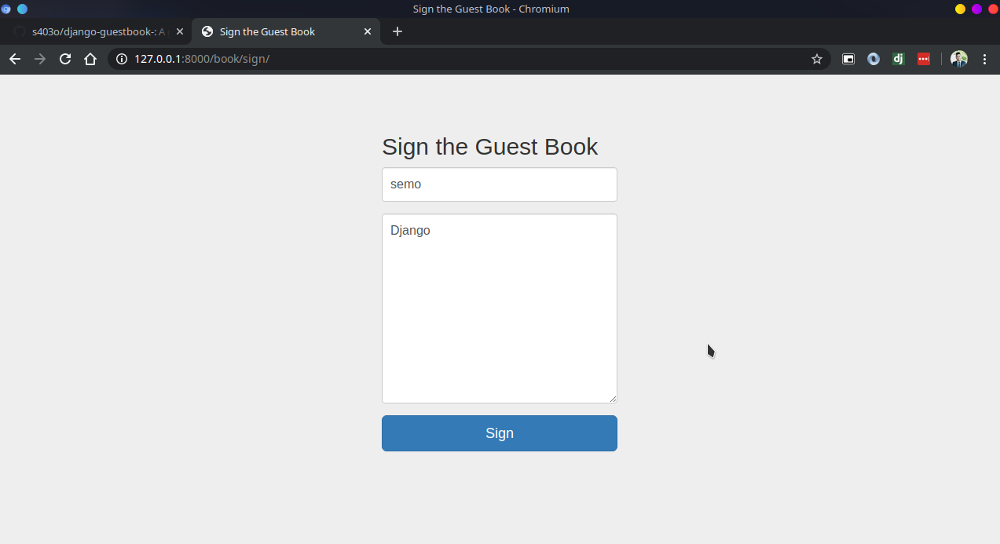

# Django GuestBook
A guestbook is a simple application for the Django web framework, It is like a comments application.

---

## install Django and Environment
    make setup
    make install
    
---

## Run
    python manage.py runserver
    
---

 ## Screenshots
 
 
